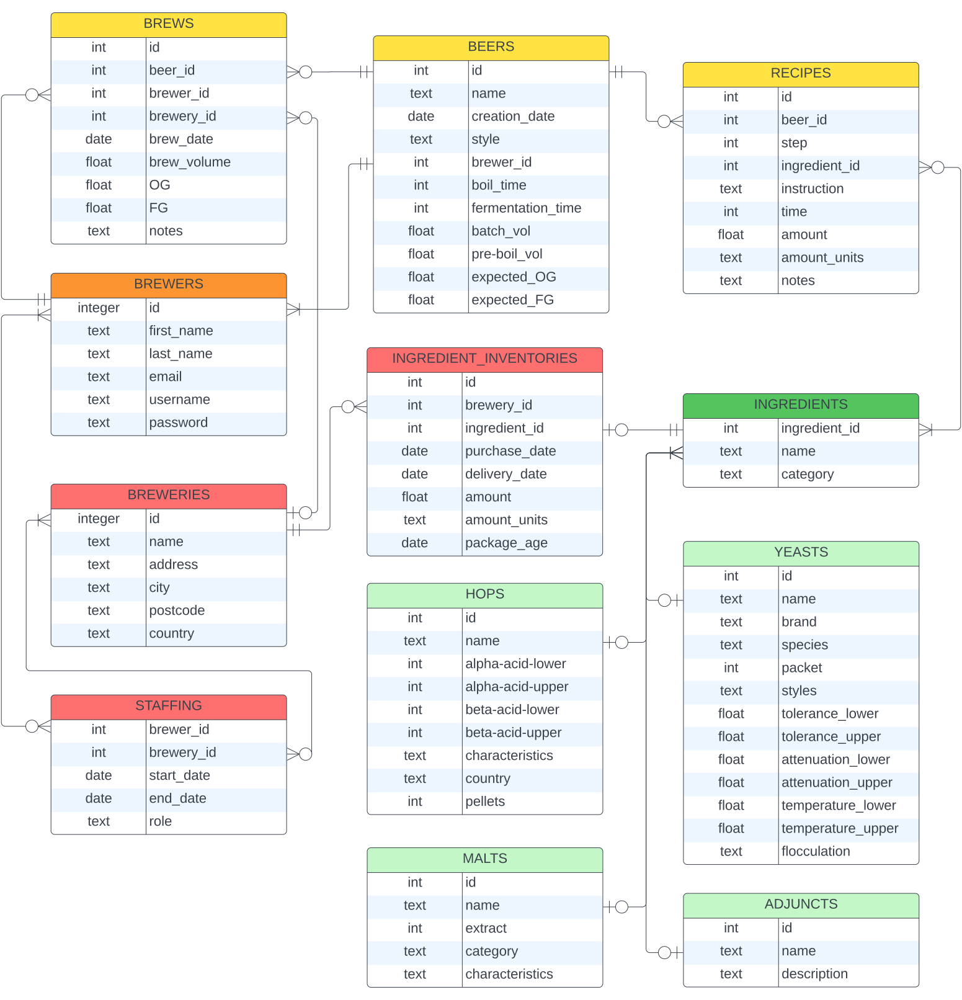

# Alcohmy - A Brewery/Brewing Management Tool
### Completed for CS50SQL
#### Author: Shannon Egan

## Introduction
This project was completed as part of the CS50SQL online course.

The Alcohmy database was designed as a system that could provide brewing support over two scales:
- Assist homebrewers and single brewers who want to keep records of their own creations, monitor their successes and failures, and view other users shared recipes
- Assist in larger scale brewery management systems, tracking inventories, production and staffing

## Scope
The scope for Alcohmy was intentionally restrained, but it was designed with the intent that new features could be conveniently added to the system. In the current state, the system contains the following general systems:
- User and brewery tracking, and the ability to assign brewers to staffing associations with brewers
- Full recipe records, including connections to databases of possible brewing ingredients
- Record keeping for brews completed, by brewers and/or breweries
- Ingredient inventories for breweries

Systems that could be added to Alcohmy in the future:
- Stored beer tracking, distributed to kegs, fermenters and bottle inventories
- Sales/use of stored beer
- Brewing measurement tracking, noting discrete temperature, density and IBU measurements
- Recipe/brewery review/rating/recommendation systems
- A system for ensuring elements of brewery specific information are kept private when intended
- Brewery specific role assignments for staffing engagements
- Additions of pay details to the staffing table
- A table for recording details for, and allow monitoring the inventory of cleaning products

## Entities
The Alcohmy database contains the following entities:

#### Brewers
* `id` - `INT` - Primary key representing a single brewer/user.
* `first_name` - `TEXT` - First name of the registered user.
* `last_name` - `TEXT` - Last name of the registered user.
* `email` - `TEXT` - Unique email address of the registered user.
* `username` - `TEXT` - Unique username of a particular registered user for sign in purposes, with a minimum length.
* `password` - `TEXT` - A password associated with a user for sign in purposes, with a minimum length.

#### Breweries
* `id` - `INT` - Primary key representing a single brewery.
* `name` - `TEXT` - Name of a registered brewery.
* `address` - `TEXT` - Street address of a registered brewery.
* `city` - `TEXT` - City of a registered brewery.
* `postcode` - `TEXT` - Postcode of a registered brewery.
* `country` - `TEXT` - Country of a registered brewery.

#### Beers
* `id` - `INT` - Primary key representing a single named recipe for a beer.
* `name` - `TEXT` - The name of a single registered beer.
* `creation_date` - `DATE` - The date a beer is registered in the database, defaulting to the current date.
* `style` - `TEXT` - The style of beer the registered beer belongs to. This may be a limited list, in practice this may be from styles such as "Hefeweisen", "Pilsner" and "Tripel", with a category of "other" for unusual creations.
* `brewer_id` - `INT` - A foreign key connecting to `brewers`.`id` representing the user/brewer who registered the beer.
* `boil_time` - `INT` - The boil time required for the brewing of this beer in units of minutes. This will default to 60 minutes, as is the case for most beers.
* `fermentation_time` - `INT` - The minimum recommended number of days for fermentation for a particular beer. This will default to 14 days if left blank, but this should potentially default to NULL to avoid misinforming users.
* `batch_vol` - `FLOAT` - The batch volume of a particular beer registry, in units of litres. This can be used to scale to the intended resulting volume of beer produced, and alongside `pre-boil_vol` will indicate process effects, to mimic the beer recipe intent.
* `pre-boil_vol` - `FLOAT` - The intended volume in litres of a particular beer's brew at the start of the boil. In practice this value will change in the brews table when the beer is actually made, but this field is essential for batch scaling of ingredients from the `recipes` table.
* `expected_og` - `FLOAT` - The expected original gravity after completion of brewing of the registered beer. This will vary in practice due to efficiency of a brew, but coupled with `expected_fg` will indicate expected alcohol by volume and taste of beer.
* `expected_fg` - `FLOAT` - The expected final gravity after completion of fermentation of the registered beer. This will vary in practice due to variation in the OG and attenuation of the yeast, but coupled with `expected_og` will indicate expected alcohol by volume and taste of beer. A check is in place to ensure that `expected_og` is less than `expected_og`.

#### Staffing
* `brewer_id` - `INT` - A foreign key connecting to `brewers`.`id` associating a staffing engagement to a particular brewer. Will also form part of a primary key with `brewery_id` and `start_date`.
* `brewery_id` - `INT` - A foreign key connecting to `breweries`.`id` associating a staffing engagement to a particlar brewery. Will also form part of a primary key with `brewer_id` and `start_date`.
* `start_date` - `DATE` - The date a staffing engagement started. This will default to the current date, but should refer specifically to when a brewer commences an engagement with a brewery. Will also form part of a primary key with `brewer_id` and `brewery_id`. Care needs to be taken when altering `start_date` to ensure that the uniqueness of `brewer_id`, `brewery_id` and `start_date` is not compromised.
* `end_date` - `DATE` - The date a staffing engagement ended. A check exists to ensure this is a later date than `start_date`, and will default to the current date if left unspecified.
* `role` - `TEXT` - The role of a brewer in an engagement with a brewery. This is currently limited to either "admin" or "user", but should likely be expanded, or have roles defined by a brewery.

#### Brews
* `id` - `INT` - Primary key representing a single "brew" or production of beer.
* `beer_id` - `INT` - A foreign key connecting to `beers`.`id` associating a brew with a particular beer.
* `brewer_id` - `INT` - A foreign key connecting to `brewers`.`id` associating a brew with the person who brewed it. Note that this only really allows space for one primary brewer at the moment, which may be a flaw for large productions, if records are to be kept of all brewers participating in a brew.
* `brew_date` - `DATE` - The date upon which a brew is completed. Defaults to the date upon which the brew is registered.
* `OG` - `FLOAT` - The unitless original gravity measurement after completion of a brew.
* `FG` - `FLOAT` - The unitless final gravity measurement after completion of fermentation of a single brew. A flaw in this field is that it can only record a single final gravity measurement. A separate table should be considered to tie this brew to successive gravity measurements over time.
* `notes` - `TEXT` - Notes recording specific observations from during the brew process.

#### Ingredients
* `id` - `INT` - Primary key representing a single recorded ingredient.
* `name` - `TEXT` - Foreign key labelling an ingredient and associating it to a table of properties associated with that ingredient category.
* `category` - `TEXT` - The category a particular registered ingredient belongs to. Must be in the following list: [hops, malts, adjuncts, yeasts]

#### Hops
* `id` - `INT` - Primary key representing a particular hop variety
* `name` - `TEXT` - The name of a hop, and a foreign key, connecting to `ingredients`.`id` associating a particular hop variety to the full table of individual ingredients.
* `alpha-acid-lower` - `INT` - The lower range of alpha acid content of a particular hop, as a percentage.
* `alpha-acid-upper` - `INT` - The upper range of alpha acid content of a particular hop, as a percentage.
* `beta-acid-lower` - `INT` - The lower range of beta acid content of a particular hop, as a percentage.
* `beta-acid-upper` - `INT` - The upper range of beta acid content of a particular hop, as a percentage.
* `characteristics` - `TEXT` - A description of the character imparted by a hop to a beer.
* `country` - `TEXT` - Country of origin of a particular hop variety.
* `pellets` - `INT` - A 0 or 1, representing whether the hops are in pellet form, or fresh.

#### Malts
* `id` - `INT` - Primary key representing a particular malt variety.
* `name` - `TEXT` - The name of a malt variety, and a foreign key, connecting to `ingredients`.`id` associating a particular malt variety to the full table of individual ingredients.
* `extract` - `INT` - A 0 or 1, representing whether a malt is in extract form or grain form.
* `category` - `TEXT` - The category of malt, base or specialty.
* `characteristics` - `TEXT` - A description of the character of the malt in a beer.

#### Yeasts
* `id` - `INT` - Primary key representing a particular strain of yeast.
* `name` - `TEXT` - The name of a a yeast strain and a foreign key connecting to `ingredients`.`id` associating a particular yeast variety to the full table of individual ingredients.
* `brand` - `TEXT` - The brand a of a particular strain of yeast.
* `species` - `TEXT` - The biological species of a particular strain of yeast.
* `packet` - `INT` - A 0 or 1, representing whether the yeast is in dry, or liquid form.
* `styles` - `TEXT` - The intended brew styles for a particular yeast strain.
* `tolerance_lower` - `FLOAT` - The lower bound of expected tolerable alcohol by volume of a yeast strain, as a percentage.
* `tolerance_upper` - `FLOAT` - The upper bound of expected tolerable alcohol by volume of a yeast strain, as a percentage.
* `attenuation_lower` - `FLOAT` - The lower bound of expected attenuation of a particular yeast strain, as a percentage.
* `attenuation_upper` - `FLOAT` - The upper bound of expected attenuation of a particular yeast strain, as a percentage.
* `temperature_lower` - `FLOAT` - The lower bound of the recommended optimal temperature range for a yeast strain to behave as expected. 
* `temperature_upper` - `FLAOT` - The upper bound of the recommended optimal temperature range for a yeast strain to behave as expected.
* `flocculation` - `TEXT` - A verbal description of the expected flocculation of a yeast strain. For example this field could be "high", indicating a high amount of flocculation exhibited by the yeast.

#### Adjuncts
* `id` - `INT` - Primary key representing a particular adjunct ingredient. This could be a fermentable such as dextrose, or a fruit or other addition.
* `name` - `TEXT` - The name of a particular adjunct ingredient. This is also a foreign key, connecting a particular adjunct to `ingredients`.`id` associating it to the main table of ingredients.
* `description` - `TEXT` - A bried description of an adjunct ingredient, and possible recommendations for its use.

#### Recipes
* `id` - `INT` - A primary key representing a step in a brewing recipe.
* `beer_id` - `INT` - A foreign key connecting a recipe step to a particular beer via `beers`.`id`.
* `step` - `INT` - An integer value, specifying the step order for a beer recipe. These values should be unique for a particular beer, and are to be used for best indication of a recipe visually. In theory, this could be omitted, and rules could be included to order steps logically based on `time` and `ingredients`.`type`, but representing a recipe clearly is important, and including this field allows this control.
* `ingredient_id` - `INT` - The unique ID of a particular ingredient used in this step of a recipe. This is a foreign key connecting `ingredients`.`id`. 
* `instruction` - `TEXT` - A text description of the what should be done in this step of the recipe.
* `time` - `INT` - The time in the boil when an addition should occur. The highest `time` value in all steps of a particular `beer_id` will define the total boil time required, and each `time` specified is the amount of time that should be left in the boil when an addition is made. For example, a `time` of 30, means that 30 mins should remain on the boil when the `ingredient_id` is added, or when the `instruction` is performed. This value should be left NULL for steps that do not occur mid boil, such as additions to the grain bill, or the addition of yeast.
* `amount` - `FLOAT` - This is the quantity of `ingredient_id` to be used in this `step` of the recipe.
* `amount_units` - `TEXT` - The units a particular `amount` should be measured in for this `step` of the recipe.
* `notes` - `TEXT` - Additional notes on this particular step of the recipe, that can be separated from `instruction`.

#### Ingredient Inventories
* `id` - `INT` - Primary key representing an entry in a breweries ingredient inventories.
* `brewery_id` - `INT` - A foreign key connecting to `breweries`.`id` associating a particular ingredient in inventory, with a particular brewery.
* `ingredient_id` - `INT` - A foreign key connecting to 'ingredients'.'id' associating an item in an inventory to a particular set of ingredient details.
* `purchase_date` - `DATE` - The date on which a particular inventory entry was purchased. This is a vital field for assessing degradation in a hop or malt's quality over time. The necessity of this field means that particular ingredients will not be unique in an inventory. Two purchases of "Galaxy" hops will require two rows in the table, to ensure that quality of each is monitored separately.
* `delivery_date` - `DATE` - The date on which a particular inventory entry was delivered or acquired by a brewery. This field is used to verify the presence of a purchase in a brewery, where lots of production is occurring. This is expected to be NULL if undelivered. 
* `amount` - `FLOAT` - The quantity of a particular ingredient in a brewery's inventory, in units specified in the `amount_units` field.
* `amount_units` - `TEXT` - The measurement units the quantity of a particular ingredient in an inventory is measured in.
* `package_age` - `DATE` - The package or production age of a particular ingredient in an inventory. This refers to the date of packaging of a hop variety, or age of a yeast package, which can have dramatic effects on their effectiveness.

### Ingredient Insertion Triggers
Insertion triggers exist for the `hops`, `malts`, `yeasts` and `adjuncts` tables, to assist in adding a unique ingredient id to the `ingredients` table, and associating it with the added ingredient. This structure ensures that the different varieties of ingredients can be referred to in the same table, such as in the `ingredient_inventories` or `recipes` tables, without having redundant fields for different ingredient types.

### Relationships

<i>Entity relationship diagram</i>

A single beer can have 0 or many steps, 0 if it has just been created or if no recipe is registered, and many if the creation steps have been added. Each of those steps can connect to 0 or 1 ingredients, and if they do connect to an ingredient, that ingredient can connect to 1 of any category of ingredient (hops, yeasts, malts, or adjuncts) to access ingredient specific details. Ingredients connect to 0 or many recipe steps, 0 if a registered ingredient is not used in any recipes, and many where it is used in steps, from one or more recipes.

A brew will connect to exactly 1 beer, as it has to be the brewing of a specific registered beer, even if that beer is a placeholder without recipe details. The brew can also be connected to a single brewery, the place it is brewed at, and exactly 1 brewer.

A brewery can have 0 or many inventory entries, 0 if nothing is being tracked, but if ingredients are monitored, an entry for each one. Each of those inventory entries will connect to a particular ingredient, and again to its associated details.

### Optimisations
A covering index was added to `staffing` on `brewery_id`, `brewer_id` to facilitate the common query of all staff at a particular brewery.

A covering index was also added to `brews` on `brewery_id`, `beer_id`, to optimise the common query for all brews made by a particular brewery.

Indexes were also added to `recipes` on `beer_id` and `ingredient_inventories` on `brewery_id` to assist the extremely common query for all recipe steps and details for a particular beer, and t query for the inventory of a particular brewery.

### Changes that <i>should</i> be implemented
* `ingredient_inventories` should have `purchased_amount` and `purchase_price` fields, for proper record keeping
* A more memory efficient strategy for `ingredients` using `id` and `category` as a primary key

### Thanks to CS50SQL
Link to information for the CS50SQL course which inspired this project can be found at https://cs50.harvard.edu/sql/2023/. I want to thank CS50SQL and all staff, particularly Carter Zenke for the course.
